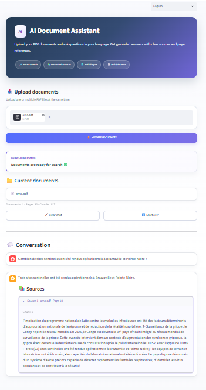

# AI Document Assistant

A multilingual AI-powered document assistant that allows users to upload one or multiple PDF documents and ask questions about their content.

The application uses a Retrieval-Augmented Generation (RAG) workflow to retrieve relevant passages from the uploaded documents and generate grounded answers with clear source and page references.

🌐 **Live Demo:**  
https://safa-ai-document-assistant.streamlit.app/

---

## Overview

AI Document Assistant is designed to make large PDF documents easier to explore.

Instead of manually searching through dozens or hundreds of pages, users can upload their documents and ask questions in natural language.

The assistant searches the uploaded documents, identifies the most relevant passages, and generates an answer using only the retrieved context.

When the documents do not contain enough information to answer a question, the assistant explicitly indicates that the information could not be found.

---

## Key Features

- Upload one or multiple PDF documents
- Ask questions in natural language
- Multilingual interface:
  - English
  - Français
  - العربية
- Multilingual document retrieval
- Hybrid retrieval using:
  - Semantic similarity
  - Keyword matching
- Source-grounded answers
- Page references for every relevant source
- Document excerpts displayed with answers
- Chat history during the session
- Clear conversation without reprocessing documents
- Start-over option for new documents
- Detection of questions that cannot be answered from the documents
- Secure API key management through environment variables
- Responsive Streamlit interface

---

## How It Works

The application follows a Retrieval-Augmented Generation workflow.


### 1. PDF Processing

The application extracts text from uploaded PDF files using **PyMuPDF**.

Each page keeps metadata such as:

- File name
- Page number
- Extracted text

### 2. Text Chunking

Extracted pages are divided into overlapping text chunks.

The chunking system attempts to preserve word boundaries so that retrieved passages remain readable.

### 3. Embeddings

Each chunk is converted into a numerical embedding using:

`sentence-transformers/paraphrase-multilingual-MiniLM-L12-v2`

This multilingual model allows semantic search across different languages.

### 4. Hybrid Retrieval

The retrieval system combines two signals:

- Semantic similarity between the user question and document chunks
- Keyword overlap between the question and the document text

This improves retrieval for both conceptual questions and precise factual queries.

### 5. Answer Generation

Relevant passages are sent to the language model through the Groq API.

The model is instructed to:

- Use only the provided document context
- Avoid inventing unsupported information
- Answer in the language of the user's question
- Identify the sources that directly support the answer

### 6. Source Display

The application displays:

- Document name
- Page number
- Relevant text excerpt

This allows users to verify where the answer came from.

---

## Example

### Question

> Combien de sites sentinelles ont été rendus opérationnels à Brazzaville et Pointe-Noire ?

### Answer

> Trois sites sentinelles ont été rendus opérationnels à Brazzaville et Pointe-Noire.

### Source

`oms.pdf — Page 18`

---

## Handling Unsupported Questions

If the answer cannot be found in the uploaded documents, the assistant does not attempt to invent an answer.

Example:

### Question

> ما هو ثمن سيارة مرسيدس في المغرب؟

### Result

> لم أجد معلومات كافية للإجابة عن هذا السؤال في الوثيقة.

No unrelated source is displayed.

---

## Technology Stack

### Frontend

- Streamlit
- Custom HTML/CSS

### PDF Processing

- PyMuPDF

### Embeddings

- Sentence Transformers
- Multilingual MiniLM

### Retrieval

- NumPy
- Cosine similarity
- Keyword-based hybrid retrieval

### Language Model

- Groq API
- `openai/gpt-oss-120b`

### Environment

- Python
- python-dotenv
- Git
- GitHub

### Deployment

- Streamlit Community Cloud

---

## Project Structure

```text
ai-document-assistant/
│
├── app.py
├── requirements.txt
├── README.md
├── .gitignore
│
└── src/
    ├── __init__.py
    ├── pdf_loader.py
    ├── chunker.py
    ├── embeddings.py
    ├── retriever.py
    ├── llm.py
    └── rag.py
```

---

## Installation

Clone the repository:

```bash
git clone https://github.com/Safa1406/ai-document-assistant.git
```

Enter the project directory:

```bash
cd ai-document-assistant
```

Create a virtual environment:

```bash
python -m venv .venv
```

Activate it on Windows:

```bash
.venv\Scripts\activate
```

Install the dependencies:

```bash
pip install -r requirements.txt
```

---

## Environment Variables

Create a `.env` file in the project root:

```env
GROQ_API_KEY=your_groq_api_key
```

The `.env` file is excluded from Git through `.gitignore`.

Never commit API keys to a public repository.

---

## Run Locally

Start the Streamlit application:

```bash
streamlit run app.py
```

Then open:

```text
http://localhost:8501
```

---

## Deployment

The application is deployed using Streamlit Community Cloud.

Production secrets such as the Groq API key are configured securely through Streamlit Secrets rather than being stored in the GitHub repository.

Live application:

https://safa-ai-document-assistant.streamlit.app/

---

## Current Capabilities

The current MVP supports:

- Multiple PDF files
- Multilingual questions
- Multilingual user interface
- Semantic document search
- Keyword-aware retrieval
- Grounded LLM answers
- Source filtering
- Page-level references
- Session chat history
- Public cloud deployment

---

## Possible Future Improvements

Future versions could include:

- OCR for scanned PDF documents
- Persistent vector database
- User accounts
- Persistent conversation history
- Document collections and workspaces
- Advanced citation highlighting
- File management dashboard
- DOCX and TXT support
- Exportable conversations
- Usage analytics
- Client-specific branding
- Access control
- Cloud document storage

---

## Security

Sensitive credentials are never stored directly in the source code.

The application uses environment variables locally and Streamlit Secrets in production.

Uploaded documents are processed during the active application session.

---

## Purpose

This project was developed as a practical RAG application demonstrating how modern AI systems can transform static documents into interactive knowledge sources.

It can be adapted for use cases such as:

- Internal company documentation
- Technical manuals
- Reports
- Academic documents
- Policies and procedures
- Training materials
- Administrative documents

---

## Author

Developed by **Safa**

---

## Live Demo

Try the application here:

https://safa-ai-document-assistant.streamlit.app/


---

## Application Preview

